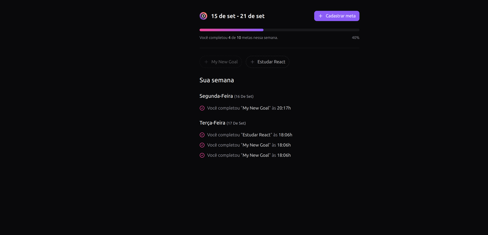
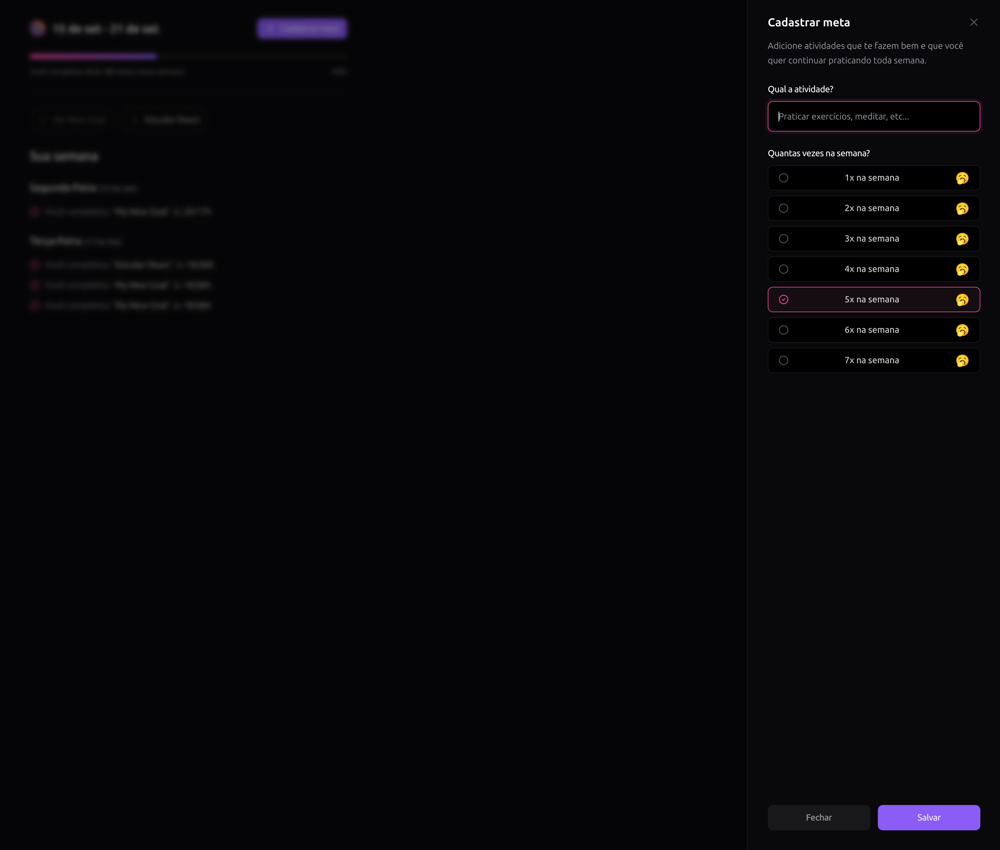

<h1 align="center">
  <a href="#">
    In Orbit WEB
  </a>
</h1>

<p align="center">
Frotnend do projeto In Orbit gerenciador de metas</p>


<p align="center">
  <a href="#%EF%B8%8F-frontend">Backend</a>&nbsp;&nbsp;&nbsp;|&nbsp;&nbsp;&nbsp;
  <a href="#-tecnologias">Tecnologias</a>&nbsp;&nbsp;&nbsp;|&nbsp;&nbsp;&nbsp;
  <a href="#-deploy">Deploy</a>&nbsp;&nbsp;&nbsp;|&nbsp;&nbsp;&nbsp;
  <a href="#-projeto">Projeto</a>&nbsp;&nbsp;&nbsp;|&nbsp;&nbsp;&nbsp;
</p><br>


## 🖼️ Backend

O frontend desta aplicação encontra-se no repositório: 
- [in.orbit-web](https://github.com/matheustorresdev97/in.orbit-api)

## 🦾 Tecnologias

Esse projeto foi desenvolvido com as seguintes tecnologias:


- VITE
- REACT-QUERY
- TAILWIND
- REACT HOOK FORM
- RADIX-UI
- TYPESCRIPT


## 🚀 Deploy

1. Faça o clone do projeto em uma pasta local 
2. Acesse a pasta onde foi feito a cópia:
3. Instale as dependencias do projeto:
```bash
npm install
```
4. Execute 
```bash
npx run dev
```

## 💻 Projeto


<br/><br/>
